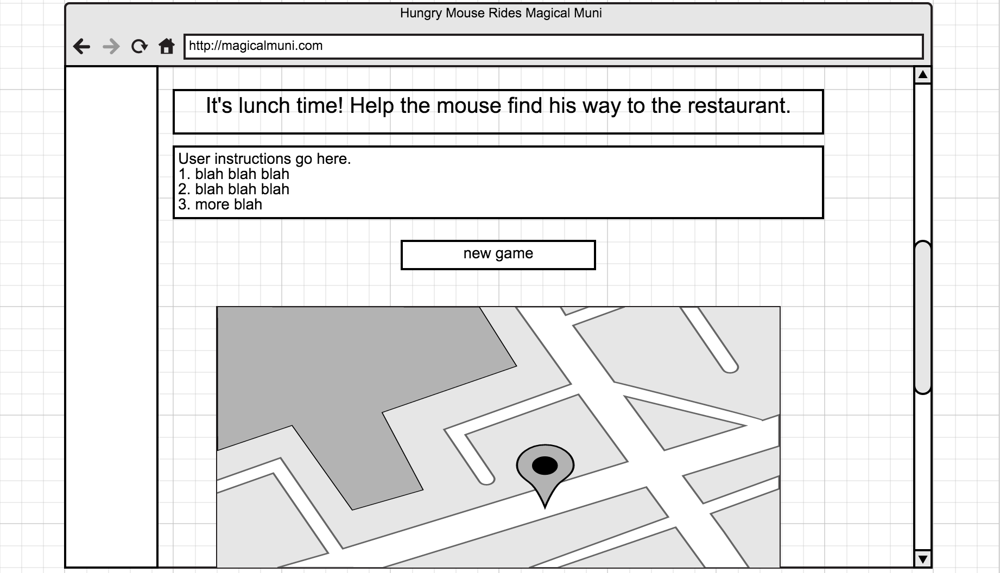

# hungry mouse rides magical muni!

# Overview

Play hangry mouse! a browser game for the masses.
 Help the mouse find his next meal PRONTO!
 Click to jump from station to station on the magical muni line.
 You must visit a shared transfer station before switing muni lines!
 Our hero is hungry, so try to find the most efficient route possible.

#Development

<b>Initial wireframe:</b>
 
 

 
 
 
User stories and project planning with help from <a href="https://trello.com/b/TQUPx8Tq/to-do-browsergame">Trello</a>.

# Technologies Used

Technologies used include Javascript/HTML/CSS, <a href="http://jquery.com/">jQuery</a>.
 Sound library can be found <a href="http://www.findsounds.com/help1.html">here</a>.
 Majority of icons sourced from <a href="http://www.clker.com/">this clipart gallery</a>.
 Magical Muni Map created by <a href="http://www.ebspelman.com/">Elliott Spelman</a>.

# Installation

No installation necessary! Click here to play: http://navigator-jessie-54355.bitballoon.com/
 Hosted by BitBalloon!

#Unsolved Problems

Random bug with the click counter--sometimes displays incorrect number clicks (very difficult to replicate, has only happened a few times).

#Features To Be Added

<ul>
	<li>Add animations to make mouse move along track as he goes from station to station</li>
	<li>Add animation so mouse "falls" from top of screen onto a Muni station when a new game is initiated</li>
</ul>

# Contributions

Contributions are welcome! Fork this repository and please submit any and all pull requests.
